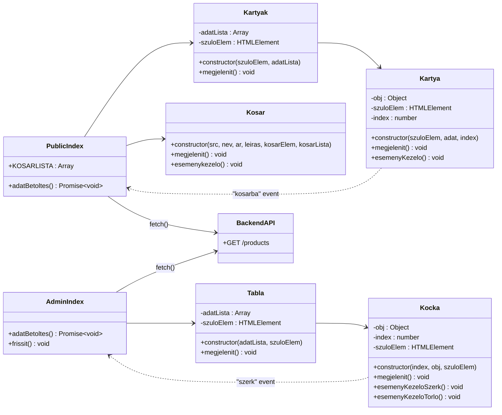

# Webáruház projekt – részletes dokumentáció

Készítette: Stolár-Németh Villő és Páczi Balázs.

Ez a projekt egy egyszerű, JavaScript alapú webáruház demó:
- **Public felület** (`index.html`): terméklista + kosár nézet.
- **Admin felület** (`admin.html`): termékek táblázatos listázása, szerkesztés/törlés gombokkal (UI-szintű kezelés).
- **Backend API** (`backend/index.js`): Express + MySQL alapú `/products` végpont.

---

## 1) Technológiai áttekintés

### Frontend
- Natív JavaScript (ES modulok)
- Bootstrap 5 (CDN)
- Eseményvezérelt kommunikáció `CustomEvent`-tel (`kosarba`, `szerk`)

### Backend
- Node.js
- Express
- CORS
- MySQL2

---

## 2) Mappastruktúra

```text
backend/
  index.js           # API szerver + MySQL kapcsolat
  package.json
  products.json      # jelenleg nem használt forrásfájl

webshop/
  index.html         # Public felület
  admin.html         # Admin felület
  js/
    index.js         # Public oldal belépési pont
    admin.js         # Admin oldal belépési pont
    Kartyak.js       # Terméklista konténerosztály
    Kartya.js        # Egy termékkártya kirajzolása + kosárba esemény
    Kosar.js         # Kosárkártya kirajzolása
    Tabla.js         # Admin tábla konténerosztály
    Kocka.js         # Egy admin sor kirajzolása + gomb események
  src/*.jpg          # Termék- és kosárképek
  readme.md          # ez a dokumentáció
```

---

## 3) Architektúra és UML



---

## 4) Működési magyarázat

## 4.1 Public oldal folyamata (`webshop/index.html` + `webshop/js/index.js`)

1. Az oldal betöltésekor az `index.js` meghívja az `adatBetoltes()` függvényt.
2. A frontend lekéri a termékeket: `GET http://localhost:3000/products`.
3. Sikeres válasz után létrejön egy `Kartyak` példány, ami minden termékhez készít egy `Kartya` példányt.
4. Minden `Kartya` létrehozza a saját HTML-jét, és egy "kosárba" gomb eseménykezelőt köt rá.
5. Kattintáskor a `Kartya` egy `CustomEvent('kosarba', { detail: termekObj })` eseményt küld.
6. A `window` szinten figyelt `kosarba` esemény:
   - hozzáadja a terméket a `KOSARLISTA` tömbhöz,
   - frissíti a kosár fejlécet (darabszám),
   - újrarendereli a kosár elemeit `Kosar` osztálypéldányokkal.

> Fontos: a jelenlegi megoldás memória oldalon egyszerű, de minden hozzáadásnál újrarendereli a teljes kosárlistát.

## 4.2 Admin oldal folyamata (`webshop/admin.html` + `webshop/js/admin.js`)

1. Betöltéskor itt is API hívás történik a `/products` végpontra.
2. A kapott adatokból `Tabla` példány jön létre.
3. A `Tabla` minden tételhez létrehoz egy `Kocka` objektumot, amely egy `<tr>` sort renderel.
4. A `Kocka` két gombot kezel:
   - **⚙️ szerkesztés:** `szerk` nevű egyedi eseményt dispatch-el az adott objektummal.
   - **❌ törlés:** megerősítést kér (`confirm`), majd kliensoldalon eltávolítja a sort a DOM-ból.

> Fontos: jelenleg az admin műveletek **nem** írnak vissza adatbázisba (nincs `PUT/DELETE/POST` endpoint használat).

## 4.3 Backend működése (`backend/index.js`)

1. Az Express app CORS támogatással indul.
2. Létrejön a MySQL kapcsolat (`webshop` adatbázis).
3. A `/products` endpoint `SELECT * FROM products` lekérdezést futtat.
4. Hiba esetén 500-as válasz, siker esetén JSON tömb.
5. A szerver a `3000` porton figyel.

---

## 5) Adatfolyam (végponttól a megjelenítésig)

1. **Browser** → `fetch('http://localhost:3000/products')`
2. **Backend** → SQL lekérdezés `products` táblára
3. **Backend** → JSON válasz
4. **Frontend** → renderelés osztályokkal (`Kartyak/Kartya` vagy `Tabla/Kocka`)
5. **User interaction** → `CustomEvent` + DOM frissítés

---

## 6) Futtatási útmutató

## 6.1 Előfeltételek
- Node.js 18+ ajánlott
- Futó MySQL szerver
- `webshop` nevű adatbázis és benne `products` tábla

Példa minimális tábla:

```sql
CREATE TABLE products (
  id INT AUTO_INCREMENT PRIMARY KEY,
  nev VARCHAR(255) NOT NULL,
  leiras TEXT,
  ar INT NOT NULL,
  src VARCHAR(255) NOT NULL
);
```

## 6.2 Backend indítás

```bash
cd backend
npm install
node index.js
```

Siker esetén: `Szerver fut: http://localhost:3000`

## 6.3 Frontend indítás

A `webshop/` mappát szolgáld ki egy statikus szerverrel (pl. VS Code Live Server), majd nyisd meg:
- `index.html`
- `admin.html`

---

## 7) Ismert korlátok és fejlesztési javaslatok

- Az admin törlés csak DOM-művelet, nem perzisztens.
- A `szerk` esemény csak naplózásra kerül, nincs szerkesztő űrlap.
- A kosár elemek törlése még nincs implementálva.
- Hibakezelés minimális (főleg console logging).

Javasolt következő lépések:
1. REST CRUD endpointok bővítése (`POST/PUT/DELETE /products/:id`).
2. Admin oldalon valódi mentés API hívásokkal.
3. Kosár törlés és mennyiségkezelés.
4. Környezeti változók (`.env`) a DB beállításokhoz.
5. Frontend oldali státusz/hibaüzenetek UX javítása.

---

## 8) Rövid összegzés

A projekt jó alap egy egyszerű, osztályalapú JS webáruházhoz: tisztán elkülönül a public és admin nézet, a backend egységes adatforrást ad, és eseményvezérelt felépítéssel kezelhető a felhasználói interakció.
